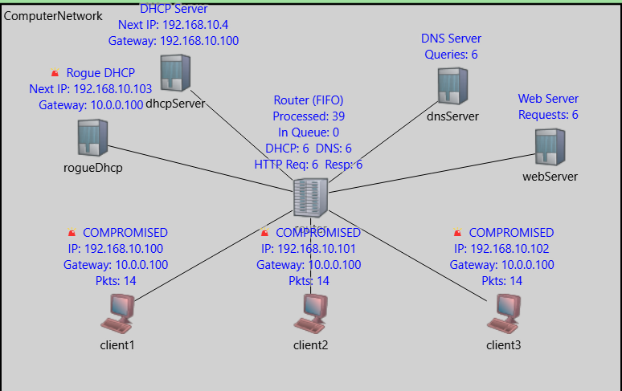

# OMNeT++ Network Lab: DHCP, DNS, HTTP with Rogue DHCP Attack

This OMNeT++ simulation models a small computer network featuring DHCP, DNS, and HTTP protocols, with a focus on demonstrating the effects of a rogue DHCP server attack.

## 🚀 Features

- Realistic network simulation using OMNeT++
- **DHCP** (legitimate and rogue server) IP assignment
- **DNS** query/response cycle
- **HTTP** web client and server interaction
- **Central router** with FIFO queueing and protocol statistics
- **Multiple clients**: normal, compromised, and attacker roles
- **Live visualization** of network activity, including protocol stats and compromised hosts

---

## 📁 Project Structure
areanetwork/
├── src/
│ ├── Computer.cc # Client node (DHCP, DNS, HTTP logic)
│ ├── DHCPServer.cc # Legitimate DHCP server
│ ├── RogueDHCPServer.cc # Rogue DHCP server (attacker)
│ ├── DnsServer.cc # DNS server
│ ├── WebServer.cc # Web server
│ ├── Router.cc # Central router
│ ├── Router.h # Router header
│ ├── messages/ # Generated OMNeT++ message files
│ │ ├── DataPacket_m.h
│ │ ├── DataPacket_m.cc
│ │ ├── DnsMessage_m.h
│ │ ├── DnsMessage_m.cc
│ │ ├── DhcpMessage_m.h
│ │ └── DhcpMessage_m.cc
│ ├── package.ned # OMNeT++ package definition
├── simulations/
│ ├── ComputerNetwork.ned# Network topology (NED)
│ ├── omnetpp.ini # Simulation configuration
└── ...

---

## 🖥️ Network Topology

- **Router**: Connects all network elements via indexed ports
- **DHCPServer**: Assigns IP addresses (legitimate)
- **RogueDHCPServer**: Assigns malicious gateway, simulates network attacks
- **DnsServer**: Resolves domains for clients
- **WebServer**: Serves HTTP requests
- **client1, client2, client3**: Simulate normal, compromised, and attacker clients

 <!-- (optional: insert your own screenshot if available) -->

---

## ⚡ How to Build and Run

**Prerequisites:** OMNeT++ 6.x installed and added to your PATH

```bash
# In the 'areanetwork' directory:
cd src

# Build the project (may require 'opp_makemake -f' to refresh makefiles)
make

# Run the simulation GUI from project root:
cd ..
opp_run -r 0 -u Qtenv -n .:../src:../src/messages simulations/omnetpp.ini
```


---

## 📝 Configuration

`simulations/omnetpp.ini` controls display and basic run parameters.  
Topology in `simulations/ComputerNetwork.ned` - you can add/remove clients, adjust server/gateway addresses, or play with queue sizes and visualization colors.

---

## 📊 Key Concepts Illustrated

- **DHCP handshake and race condition**
- **Rogue vs. legitimate server detection**
- **DNS resolution and HTTP request sequence**
- **Packet routing and queueing**
- **Per-protocol statistics displayed in the GUI**
- **Live simulation of a successful DHCP attack**

---

## 📈 Simulation Results
Example Run Statistics:

- **Attack Success Rate: 100% (rogue server wins in current configuration)**
- **Average Queue Length: 1–3 packets**
- **Service Time per Packet: 0.01s**
- **Total Packets Processed: 42 (example run)**

---

## 📚 How It Works

1. **Clients** boot and try to get an IP via DHCP.
2. **Both DHCP servers** respond; first to reply "wins" the client.
3. **Clients** with a legitimate gateway behave normally; those who accept the rogue gateway are compromised.
4. **Clients** then perform DNS and HTTP operations to fetch a web page.
5. **Router** keeps track of all packets using protocol counters.

Watch the simulation to see compromised clients, DNS and HTTP traffic, and real-time protocol statistics.

---


